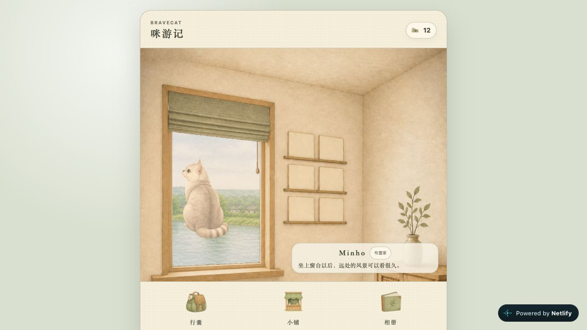

# 公网首页截图：肉眼可见问题记录

日期：2026-09-29。用户要求：总结并记录，不修复。状态：仅记录，未修改业务代码、样式、素材或部署。

## 证据与范围

唯一视觉证据为 [首次公网首页截图](../releases/archive/2026-09-29-netlify/first-public-home.png)，1280 × 720。截图来自首个公开部署 `bba26ffa1f7e`；当前部署 `ce600e654045` 只改响应头，未重新完成新版视觉验收。本记录不冒充手机端、其他主题、其他姿势或整个游戏的全面检查。

下表坐标为原图左上角起算的近似像素。优先级只用于后续排查排序，不代表已安排修复。明确可见的画面缺陷与主观可用性观察分开标记；根因未经代码定位。

## 问题清单

| ID | 优先级 / 性质 | 位置 | 肉眼可见的现象 | 影响与证据边界 |
| --- | --- | --- | --- | --- |
| V01 | 高 / 明确画面缺陷 | 猫与窗台，约 x398–499、y350–600 | 猫的身体与尾巴底部停在约 y520，窗台在约 y585–610，两者之间仍是窗外水面，没有可见承托。 | 猫看起来悬浮在窗外，未坐在室内窗台上；这是本图最显著的问题。透明边距、定位锚点、缩放与图层关系只是待查方向，不能从截图确认具体根因。 |
| V02 | 高 / 明确图文矛盾 | 右下说明，约 x650、y580 | 文案写着“坐上窗台以后，远处的风景可以看很久。”，画面却未呈现坐上窗台。 | 状态描述与可见姿态不一致。与 V01 相关，不能把它们统计为两个已确认的独立代码根因。 |
| V03 | 中 / 场景呈现问题 | 主场景约 x305–975、y105–614 | 可见区域主要是墙面与窗户，没有地面；右下家具只露出局部，猫窝和隧道在图中不可见。 | 首页难以展示“家”的完整布置。只能确认截图中不可见，不能据此认定用品未加载、未放置，或一定是 CSS 裁切错误。 |
| V04 | 中 / 首屏适配观察 | 画面下沿 y720 | 底部导航延伸到截图下边界，外层卡片底边、底部圆角及完整下留白没有进入截图；顶部和左右边界则完整可见。 | 1280 × 720 首屏没有完整容纳这张界面卡片。三个入口文字仍可读，未见其被遮挡；截图不能判断是否可以滚动，也不能认定内容永久丢失。 |
| V05 | 中 / 视觉布局观察 | Minho 信息卡，约 x637–955、y531–596 | 浅色信息卡覆盖右下花瓶下部及家具区域，与左侧猫相距较远，卡片未表现出与猫或家具的自然位置关系。 | 信息层打断场景连续性，名称与猫的视觉关联偏弱。属于构图和遮挡观感，不代表卡片功能故障或不符合已确认规格。 |
| V06 | 低 / 控件辨识观察 | “布置家”与说明文字，约 x650–930、y538–590 | “布置家”按钮及标签明显小于底部三大导航，说明文字也较细小，叠在有纹理的浅色卡片上。 | 次级操作不够醒目，阅读与辨识负担较高。截图不能测得真实点击区域、CSS 字号或对比度数值，不作触控尺寸不合格或无障碍违规结论。 |
| V07 | 中 / 平台标识干扰 | 视口右下约 x1086–1262、y664–703 | 深色“Powered by Netlify”悬浮徽章位于游戏卡片外，与浅色手绘场景的色彩和风格反差明显。 | 抢夺注意力，削弱游戏沉浸感。在这张桌面截图中没有遮挡游戏按钮；移动端是否遮挡尚未知，不能提前认定。 |

## 可见但暂不判定为缺陷

- 墙面六个空相框：画面确实为空，但新存档可能尚无收藏；没有依据认定漏图。
- 桌面左右大面积留白：窄幅居中布局的可见结果，缺少目标布局依据，不单独列为适配错误。
- 猫的相对大小与回头姿势：仅凭本图不能确认比例或姿势选择错误。V01 记录的是明确缺乏承托，不扩展成未经验证的比例问题。
- 小鱼干图标较小且风格抽象：数值“12”清晰，没有足够证据认定图标错误或渲染异常。
- 底部三个导航图标与文字均可见：不能把外层卡片未完整入镜描述为导航不可用。

## 验收结论与待确认边界

这张截图只能作为页面实际打开和部分素材呈现的证据，不能作为视觉验收通过的证据。此前资源加载、领养、存档刷新与 HTTP 校验通过的结论保留，但不覆盖以上视觉问题。

未进行修复、重新部署或补充浏览器测试。后续若进入修复阶段，应先定位猫与窗台的落点及场景可见范围，再分别检查桌面和手机尺寸。移动端徽章遮挡、用品实际渲染位置、滚动行为、动画其他帧、其他主题、相册与故事页面不在本截图的可确认范围内。
