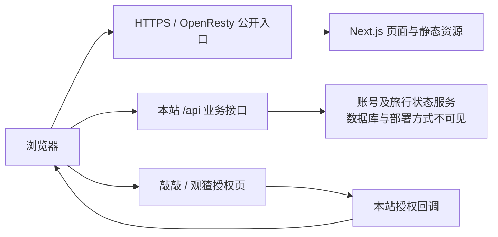

# Animal Trip 公网部署与注册方案观察

观察日期：2026-09-29。范围：公开首页、首页明确引用的客户端脚本、HTTP 响应头及未登录 UI。未注册账号、未发送验证码、未提交表单、未探测未公开接口。客户端代码能证明调用方式，不能证明服务器具体实现或已登录行为。

## 结论

这是带有同源业务 API 和第三方账号接入的 Next.js Web 应用；公开入口经 OpenResty 提供服务。首页可以预渲染，但账号、旅行状态及业务操作依赖后端。不能把它理解为只上传一个 HTML 的纯静态站点。

以下架构是公开证据支持的概念图，不代表其内部进程、机器或云产品拓扑：

## 部署证据

| 观察 | 证据 | 能得出的结论与边界 |
| --- | --- | --- |
| 首页 HTTP 200，`server: openresty`、`x-powered-by: Next.js` | [首页](https://animaltrip.qiaoqiao.social/) 响应头 | 公开入口呈现 OpenResty、Next.js 特征；不证明内部只有一台服务器，也不证明具体云厂商。 |
| `x-nextjs-cache: HIT`、`x-nextjs-prerender: 1`、`x-nextjs-stale-time: 300` | 同上 | 本次首页响应来自 Next.js 预渲染/缓存路径；不能据此认定所有页面都是动态 SSR 或整个应用可静态导出。 |
| 首页有 Next.js Flight 数据、Turbopack chunk、Next Image URL | [首页](https://animaltrip.qiaoqiao.social/) | 确认 Next.js 客户端应用；图片使用 `/_next/image` 路径与尺寸变体。未确认图像处理服务的内部部署。 |
| JS 路径带构建指纹，响应有 ETag、Expires、Cache-Control | [客户端配置 chunk](https://animaltrip.qiaoqiao.social/_next/static/chunks/0flu6hwe43i3a.js) | 具备静态资源 HTTP 缓存。本次 max-age 约 61770 秒，不能把一次采样当成永远固定的缓存周期。 |
| API_BASE 编译为本站 HTTPS origin | 同上 | 浏览器业务请求走同源 `/api`；内部可以由 Next.js 或另外的后端接收，外部不能区分。 |
| 未见 manifest link、公开首屏 chunks 未见 serviceWorker 注册 | [首页](https://animaltrip.qiaoqiao.social/) 及其 scripts | 未找到完整离线 PWA 的证据。apple-touch-icon 仅证明有图标，不等于可离线 PWA；也不能据此断言其他页面没有 PWA 功能。 |

补充边界：本地 DNS 返回 `198.18.0.181`，可能是代理 fake-IP，不能用于服务器定位。域名 NS 为 `vip1.volcengine-dns.com` / `vip2.volcengine-dns.com` 只能说明权威 DNS 服务，不能证明应用托管于火山引擎。未确认 CDN、云区域、容器、数据库、对象存储、备份与 CI/CD。

## 注册与会话

公开 UI 的核心是多入口账号体系：敲敲登录、敲敲注册、观猹登录、本站邮箱登录/注册，另有免登录游客试玩。登录页文案提示动物去哪儿账号在授权后自动创建或同步；游客可体验 3 次短途旅行。[首页](https://animaltrip.qiaoqiao.social/)、[文案 chunk](https://animaltrip.qiaoqiao.social/_next/static/chunks/0sk1pw8rk787k.js)。

| 入口 | 客户端可确认的流程 | 未验证部分 |
| --- | --- | --- |
| 敲敲登录 | 跳转授权地址，携带 client_id、redirect_uri、response_type=code、state；回调路径为本站 `/api/auth/qiaoqiao/callback`。 | 服务端授权码交换、state 绑定和校验、账号合并规则不可见。 |
| 去敲敲注册 | 跳转敲敲 `/login?tab=register&source=animaltrip`。 | 该页面实际显示动物去哪儿快捷注册，仅需邮箱、密码，其他资料可稍后补；完整提交闭环未经验证。 |
| 观猹登录 | 浏览器经过本站 `/api/auth/watcha/start`，到 `watcha.cn/oauth/authorize`，授权码模式，scope=read、state、本站 callback。授权页提供大陆手机号验证码/密码登录，提示未注册手机号验证后自动注册、需同意协议。 | 未发送验证码、未登录、未完成回调。 |
| 本站邮箱注册 | POST `/api/auth/register`，请求体为 email、password、username。表单前端密码最少 6 位。客户端预期成功响应含 token、user，可能有 presenceSessionId，随后进入已登录状态。 | 所观察表单和该调用未含邮件验证码步骤，但未验证后端额外校验、密码存储、找回与邮件验证策略。 |
| 本站邮箱登录 | POST `/api/auth/login`，请求体为 email、password。 | 未提交账号信息，不能证明服务端登录成功率和风控。 |
| 游客 | 本机创建试玩状态并写 sessionStorage；与登录账号状态读取路径不同。 | 未证明游客进度会自动迁移到新账号。 |

敲敲注册落点：[快捷注册页](https://qiaoqiao.social/login?tab=register&source=animaltrip)。该页本次响应出现 Byte-nginx、Via 和 X-Bdcdn-Cache-Status 等 CDN 缓存层特征；这是敲敲父站的证据，不能外推到 Animal Trip 子站。

客户端来源：[主业务 chunk](https://animaltrip.qiaoqiao.social/_next/static/chunks/0bl9zs-0liw_y.js)、[配置 chunk](https://animaltrip.qiaoqiao.social/_next/static/chunks/0flu6hwe43i3a.js)。以上列出的接口仅从公开代码读取，并未逐个调用。

会话实现的公开部分：

- 邮箱登录 UI 有“记住密码”，但所观察主业务 bundle 中该字段仅初始化和绑定复选框；提交函数不读取它，也未发现按它存储密码的逻辑。登录成功会清空表单密码。不能据 UI 推断它将明文密码保存到 localStorage。
- 登录 token、用户摘要及 presenceSessionId 写入 localStorage 的 `animal-trip-auth`；请求使用 Bearer token。
- 重新打开时读取本地 token，调用 `/api/auth/me` 校验，然后读取 `/api/demo/state` 获取账号游戏状态。
- OAuth 返回的客户端分支读取 URL fragment 中的 `qiaoqiao_token` / `watcha_token`，随即清理地址，再验证会话。这证明它不是单纯在前端保存第三方登录标志。
- 存在 presence heartbeat/offline 调用，说明客户端还管理在线状态。正式账号的旅行、收藏、社交等通过业务 API 交互。

这些是源码观察，不能据此认定存在漏洞。若 BraveCat 引入账号，token 生命周期、服务端会话、授权回调校验、密码恢复、游客存档合并与冲突处理都需要自己的设计和验证；不应直接复制其可见的 localStorage token 策略。[主业务 chunk](https://animaltrip.qiaoqiao.social/_next/static/chunks/0bl9zs-0liw_y.js)。

## 对 BraveCat 的实际意义

当前 BraveCat 免费首发可以继续采用静态托管 + HTTPS + 浏览器本地存档 + 导入导出，不需要为了公网访问而加注册系统。可借鉴的是稳定域名、同源资源、低门槛试玩及清晰的账号收益说明。

若下一阶段需要跨设备存档或社交，再增加账号/API/持久化存储，而不是把它当成部署配置的小修改。至少需完成身份提供方接入、服务端会话与鉴权、存档归属与并发控制、游客进度迁移、恢复/注销、限流及运维备份。其具体后端成本、云服务账单和可用性不能从公开页面推算。

## BraveCat 可采用的分阶段方案

| 阶段 | 部署形态 | 账号策略 | 目的 |
| --- | --- | --- | --- |
| 当前公网首发 | 现有 Svelte/Vite 发行包，稳定 HTTPS 域名根路径，同源图片与 PWA | 保持免注册、本机存档与 JSON 备份 | 先验证真实公网访问和移动设备体验，不改变已批准首发范围。 |
| 后续跨设备版本 | 静态前端继续保留，复用仓内 `services/api` 基础并接入持久化存储 | 可选账号，明确“备份/换设备恢复”收益；保留原有访客进度 | 注册完成与存档绑定/冲突策略一起交付，避免只做登录框却丢失已有进度。 |

无需因为友商使用 Next.js 就迁移前端框架。Next.js 自托管可采用 Node.js 或容器并配置反向代理，公开指纹不足以区分友商内部实现。[Next.js 官方自托管文档](https://nextjs.org/docs/app/guides/self-hosting)。

若下一阶段采用同源账号服务，建议评估服务端会话加 HttpOnly/Secure Cookie，并配套 CSRF 防护；不要把 localStorage 中的 token 或“记住密码”UI直接作为设计模板。OWASP 指出 JavaScript 能访问 localStorage，XSS 会威胁其中的敏感数据和会话标识。[OWASP HTML5 Security Cheat Sheet](https://cheatsheetseries.owasp.org/cheatsheets/HTML5_Security_Cheat_Sheet.html#local-storage)。此处是 BraveCat 的工程建议，不是对友商进行了安全测试或发现了可利用漏洞。
